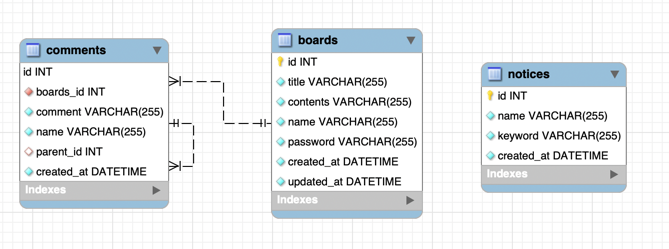

## Node.js 토이 프로젝트

### migration
```
// Create Database
npx sequelize db:create

// Create Table 
npx sequelize db:migrate
```

### ERD


### 구현 및 작성 목록
- 게시글 목록 API ```(GET) /api/board?page={page}&size={size}&keyword={keyword}```
- 게시글 작성 API  ```(POST) /api/board```
- 게시글 수정 API ```(PUT) /api/board/:boardId```
- 게시글 삭제 API ```(POST) /api/board/:boardId```
- 댓글 목록 API ```(GET) /api/comments/:boardId```
- 댓글 작성 API ```(POST) /api/comments/:boardId```
- 게시물 또는 댓글 등록시 알림 기능 구현 ```notices```
